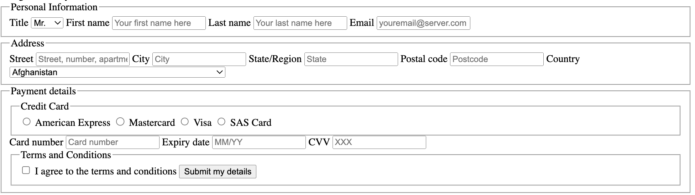
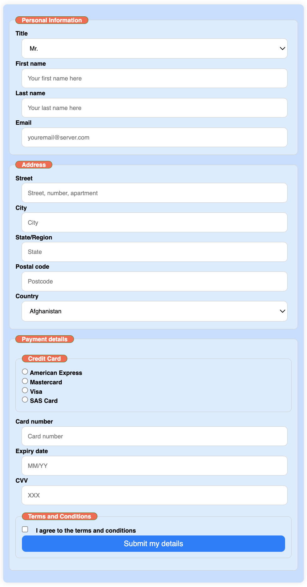

[](https://classroom.github.com/a/jSmldfs0)
[](https://classroom.github.com/open-in-codespaces?assignment_repo_id=17034737)
# Activity #3 : Forms

## Introduction

### Preamble

1. This is an assynchronous learning activity composed by 3 Parts.

2. The activity will be delivered to each student as a github repository.

3. For each part it is suggested that you create a new git branch 
4. During the activity a forum will be available at moodle to share knowledge about this module.
5. At the end the result should be deployed at GitHub Pages.
6. At the end you should also submit the URLs in moodle

6. Commits are allowed until November 20th

Notice that although submitting the work is compulsory, the most important result is the learning achieved.

The activity can be carried out with consultation of any sources, does not have a strict time limit for completion and can be done individually or in groups, as long as the aim of individual learning is safeguarded.

### Learning Resources & Materials

You can find at the **[slides](slides/)** folder the  [**slides-forms.pdf**](slides/slides-forms.pdf) set of slides that contain the fundamental information about **HTML Forms**. 

Along the activities, this document algo points to specific learning resources regarding the proposed tasks.

### git / GitHub Setup

1. **Clone** the github repository into a folder in your local machine.

```sh
git clone URL
```

2. To start, **create a new branch** "Part1"

```sh
git checkout -b Part1
```

3. Work in your project,  making regular commits as appropriate.

4. Make a **last commit** when Part1 is finished.

```sh
git add .
git commit -m "Part1 is finished"
```

5. At this point (and probably during its development), **push** into the GitHub repository

```sh
git push origin Part1
```

6. Repeat the process for the next parts. **create a  branch** Part2 as new branch of Part1.

```sh
git checkout -b Part2 Part1
```

[**alternative to  6**) you may alternatively **merge Part1 branch with main branch** and **branch Part2** from the main branch.``

```sh
git checkout main
git merge Part1
# resolve any conflicts
git push origin main
git checkout -b Part2
```

### GitHub Pages setup

Your results should be configured to be deployed from GitHub Pages (only static content)

You can choose from which branch to deploy your page.

**Read the Guide: [Quickstart for GitHub Pages](https://docs.github.com/en/pages/quickstart)**

* Be aware that deploy is not instantaneous (it can take some time since the last commit/push)

* Be aware of caching issues (git hub sets 600s as cache age policy). Some mitigation recipes:

  * **most effective:** clear browser cache

  * **Add metatags to HTML files**, trying to enforce shorter or no-cache policies (**no warranty**)

    * ```html
      <meta http-equiv="Cache-Control" content="no-cache, no-store, must-revalidate"> 
      <meta http-equiv="Pragma" content="no-cache">
      <meta http-equiv="Expires" content="0">
      ```

# ====== Part I ======

##### Preparation: make a **Part1** branch

## Creating a Form Structure with HTML

### Objective:

The goal of this activity is to learn:

* what are forms and what are they important
* what are the forms basic structural blocks
* which types of inputs and controls are available
* at the end you will be ready to create a well-structured HTML form.

### Learning Resources and Materials

There is a lot of information at the Form learning Guide @MDN

* **[Web form building blocks](https://developer.mozilla.org/en-US/docs/Learn/Forms)**

If you are not an expert on HTML Forms, read the [overview](https://developer.mozilla.org/en-US/docs/Learn/Forms) first two introductory guides :

**[Your first form](https://developer.mozilla.org/en-US/docs/Learn/Forms/Your_first_form)**
**[How to structure a web form](https://developer.mozilla.org/en-US/docs/Learn/Forms/How_to_structure_a_web_form)**

You can then proceed to the pratical activity, reading more information as you need. 

Check the files already in the repository. as they have start or utility code:

* **Index.htm** : just veryu basic starter code for the form with a fiel for the countries (dynamically built)
* **styles.css** : starter code for the css. not yet linked with the page.
* **loadloac.js** : implements the dynamic load/build of the country field
* **loc.json**: list of countries and isocodes

### Expected Result

As the form is not formatted, and supposing there is not any extra structure. the form should look similar to the following image (see **Detailed Instructions** below)



### Detailed Instructions:

1. **HTML Structure:**
   - Create a new HTML file named `index.html`.
   - Ensure that the HTML document has a proper [structure](https://developer.mozilla.org/en-US/docs/Learn/HTML/Introduction_to_HTML/Document_and_website_structure).

2. **Form Elements:**

   - Create a [form](https://developer.mozilla.org/en-US/docs/Learn/Forms/How_to_structure_a_web_form) with the following sections:
     - Personal Information
     - Address
     - Payment Details
     - Terms and Conditions
   - Use [`<fieldset>`](https://developer.mozilla.org/en-US/docs/Web/HTML/Element/fieldset) and [`<legend>`](https://developer.mozilla.org/en-US/docs/Web/HTML/Element/legend) tags to group related form elements together.

3. **Form Fields:**

   Each section contais form fields to support the input of the required information. If appropriate use a specific [html5 input type](https://developer.mozilla.org/en-US/docs/Learn/Forms/HTML5_input_types), otherwise use a [basic native form control](https://developer.mozilla.org/en-US/docs/Learn/Forms/Basic_native_form_controls).

   - Personal Information:
     - Title ([dropdown select](https://developer.mozilla.org/en-US/docs/Web/HTML/Element/select)) [optional, choose among Mr. Mrs. Ms. ... ]
     - First Name (text input) [required, text]
     - Last Name (text input) [required, text]
     - Email [required, email format username@domain.xxx]
   - Address:
     - Street (text input) [required, text]
     - City (text input) [required, text]
     - Postal code (text input) [required, DDDD-DDD format]
     - Country (dropdown select) [required]
   - Payment Details:
     - Credit Card Type ([radio buttons](https://developer.mozilla.org/en-US/docs/Web/HTML/Element/input/radio)) [required, choose one Visa, Mastercard, SAS]
     - Card Number (text input)[required, 13 to 19 digits]
     - Expiry Date ([month](https://developer.mozilla.org/en-US/docs/Web/HTML/Element/input/month)) [required, month/year MM/YYYY]
   - Terms and Conditions:
     - [Checkbox](https://developer.mozilla.org/en-US/docs/Web/HTML/Element/input/checkbox) to agree to terms and conditions [required]

4. **Form Submission:**
   - Include a [submit button](https://developer.mozilla.org/en-US/docs/Web/HTML/Element/input/submit) at the end of the form.

### About the country field

### Submission:

- make a "FINAL PART 1" commit and push it to youS repository .
- deploy from branch Part1 to GitHub Pages

### Checklist:

- Correctness and completeness of the HTML structure.
- Ensure that your form is well-structured and all fields are correctly [labeled](https://developer.mozilla.org/en-US/docs/Web/HTML/Element/label) and grouped.
- Clarity and readability of the code.

# ====== PART II ======

##### Preparation: make a Part2 branch

## Styling a Form with CSS

### Objectives:

The goal of this activity is to learn:

* what are the main difficulties regarding form styling
* what are the best practices of form styling UI/UX
* at the end you will be ready to style a well-structured HTML form.

The goal of this activity is to create a CSS file to style an HTML form, making it visually appealing and responsive. You will use the form structure developed earlier at **Part I** and apply CSS styles to make the form look similar to the following image.

### Learning Resources and Materials

Besides overall knowledge of **[CSS](https://developer.mozilla.org/en-US/docs/Web/CSS),**, the following tutorials give you specific information about form styling

[**CSS Forms**](https://www.w3schools.com/css/css_form.asp)

**[Styling web forms](https://developer.mozilla.org/en-US/docs/Learn/Forms/Styling_web_forms)**

**[How to style forms with CSS: A beginner’s guide](https://blog.logrocket.com/style-forms-css/)**

Always keep in mind the following UI/UX best practices:

* **keep it short**
* **layout** as a **single column** (usually the best option)
* **visually group related fields;** present it in a **logical sequence**.
* **use placeholders for hints **
* **distinguish** between **required** vs **optional** fields
* **highlight the focus element** (`:focus`)
* Provide **autofill** and **autocorrect**.
* **Exclude all unneeded info** (text, pictorial, etc)
* avoid **reset** and **clear** buttons
* style **valid** and **invalid** inputs  `:valid`  `:invalid` (for validation purposes)
* provide **meaningful inline error messages** (for validation pruposes)

### Expected Result

You can guide your design by the following example.

{width="400px"}

### Instructions:

1. **HTML Structure:**

   - Use the form structure from Part I.
   - Ensure that the HTML document is correctly structured with `<!DOCTYPE html>`, `<html>`, `<head>`, and `<body>` tags.
2. **CSS Styling:**
   - Create a new CSS file named `styles.css`.
   - Link the `styles.css` file to your `index.html` file using a `<link>` tag within the `<head>` section.
3. **Form Styling:**
   - Apply a responsive design to the form using CSS.
   - Ensure that the form looks good on both desktop and mobile devices.
   - Style the fieldsets and legends to visually enhance grouping and  context.
   - Style the labels, inputs, and buttons to ensure consistent padding, margins, and font styles.
   - Ensure that the form elements are visually consistent and easy to use.

### Submission:

- make a "FINAL PART 2" commit and push it to your repository .
- deploy from branch Part2 to GitHub Pages

## ====== PART III ======

### Client Side Form Validation with JavaScript

##### Preparation: make a Part3 branch

### Objectives:

The goal of this activity is to learn:

* why form validation is important
* distinguish between client side and server side form validation
* the approches to client side form validation
* at the end you will be ready to implement client side form validation.

### Learning Resources & Materials

1. read/study  the [**slides-forms**](slides/slides-forms.pdf) parts about validation
2. supported by the slides analyse the jsfiddle working examples:
   1. [Built-in html5 form validation](https://jsfiddle.net/pmoreira/vrwn6L78/)
   2. [Custom javascript validation](https://jsfiddle.net/pmoreira/1szdowtk/)
   3. [Custom live javascript validation](https://jsfiddle.net/pmoreira/0atncxwh/)
3. Alternative to the above, check these content
   1. [**Client-Side Form Handling with JavaScript – Explained with Example Code**](https://www.freecodecamp.org/news/form-validation-in-javascript/) (text)
   2. **[Client-side form validation](https://developer.mozilla.org/en-US/docs/Learn/Forms/Form_validation)**

### Instructions:

1. **HTML Structure:**
   - Use the HTML form structure from Part II. Add any additional structure or validation information if needed.
2. **Form Validation:**
   * Write a `validation.js` file that is included in `index.html` via a `script` tag with the **`difer`** attribute.
3. **Implement** validation using the rules presented at Part II

### Submission:

- make a "FINAL PART 3" commit and push it to your repository .
- deploy from branch Part3 to GitHub Pages

# Final Remarks

* Good Work

* Do not forget to submit URLs at moodle

pedro miguel moreira 2024

